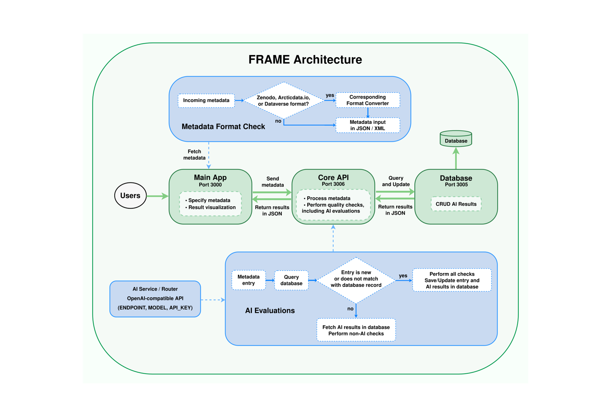

# What does FRAME do?

FRAME reads a metadata record formatted in JSON (JavaScript Object Notation). This tool then performs multiple checks defined in `rules.json`. Finally, FRAME displays the status of each check and a summary report for further inspection. Here are some examples of the checks performed by FRAME:

- Dataset title length
- Presence of DOI (Digital Object Identifier)
- Author information, such as names, ORCIDs, and affiliations
- Date of publication
- Quality of description, readme, and documentation file(s)
- Public landing page
- Data access URLs, including direct downloads and API access
- License
- Geospatial extent
- Cloud-based integrations, such as an online visualization portal or JupyterHub

<!-- The author information checks (creator_exists, creator_identifier_exists,
creator_affiliation_exists in rules.json) currently all test the same
condition — that `authors` is a non-empty array — rather than separately
validating ORCID format or affiliation presence. Update this list or the
underlying rules so the description matches the actual checks performed. -->

## What are the FAIR data principles?

FRAME checks the quality of metadata records based on the FAIR data principles. The FAIR data principles are a set of guidelines for managing and sharing research data (and other digital assets) to maximize their usefulness. FAIR stands for:

- **Findable.** Data should have rich metadata and a unique, persistent identifier, such as a digital object identifier (DOI), and be indexed in a searchable resource so both humans and machines can locate it.

- **Accessible.** Data should be retrievable using standard, open protocols, with or without prior authentication. In the case that the data itself is or becomes restricted, the associated metadata should remain accessible.

- **Interoperable.** Data should use standard vocabularies, formats, and languages so it can be integrated with other datasets and used by different applications or workflows across disciplines.

- **Reusable.** Data should be well-documented with clear licensing, provenance, and context so others can understand, trust, and reuse it appropriately for future research.

Developed in 2016 by a group of scientists and organizations, the FAIR principles aim to improve data stewardship, especially for machine-readability, without necessarily requiring data to be "open" — they focus on making data well-described and usable, regardless of access restrictions.

## How it works

FRAME is a web-based tool that can be divided into three parts:

1. **Main application**: A graphical interface for users to specify metadata inputs and check assessment reports. The metadata inputs are checked by a format converter to ensure they follow a desired format for FRAME to parse and analyze. 
2. **Core API**: A core processor that performs various checks on the metadata inputs. It also communicates with an AI service since some checks are evaluated by a selected large language model (LLM). Besides, there is a separate endpoint for users to send metadata and retrieve reports without using the main application.
3. **Database**: A database and an associated API for storing previous AI-based evaluations in order to conserve tokens.

