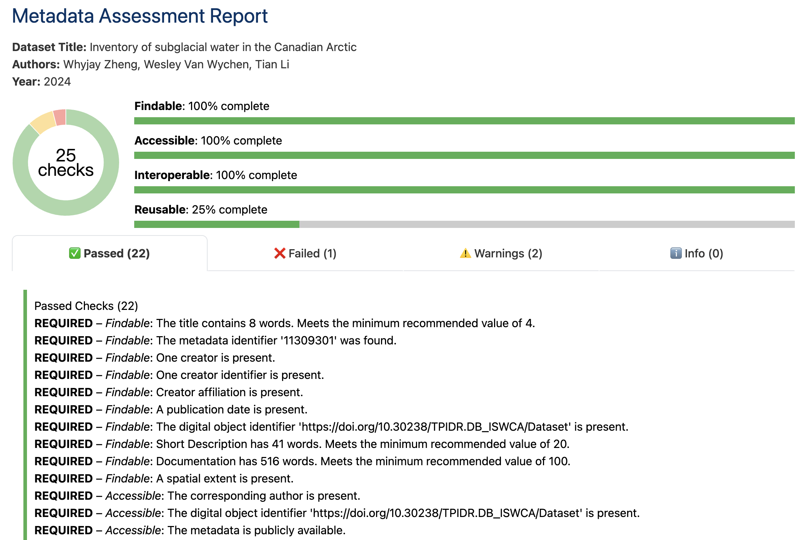

# FRAME

FRAME (**FAIR Review and Metadata Evaluation Engine**) is a web-based tool to assess the quality and completeness of the metadata for a given dataset based on the FAIR (Findable, Accessible, Interoperable, and Reusable) principles. With predefined criteria, FRAME accesses the metadata via a URL, reviews the content, validates its FAIRness, and finally provides quality scores for the metadata. This tool is designed for researchers and dataset administrators who need to host or use open datasets, as it provides a common basis for communication about data sharing, an important component of open science. 

